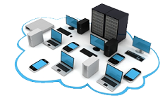

# GLPI
Gestionnaire libre de parc informatique (Free Management of Computer Equipment). 
GLPI is a free asset and IT management software.

## Features
* Buildings, rooms and computers management.
* Computers management includes the management of:
	* Name
	* Status
	* Manufacturer
	* Serial Number
	* Model
	* Installation Date
	* OS
	* OS version
	* Date OS Installation
	* Room
	* Building
* Rooms management includes the management of:
	* Name
	* Building
	* Number of computers
* Buildings management includes the management of:
	* Name
	* Number of rooms
* Several search filters are available to find specific buildings, rooms, computers more efficiently.
* Possibility to update the buildings, rooms and computers information.
* Possibility to add new buildings, rooms and computers.
* Saving and loading are automatic in the **dist/save.dat** file.

## Requirements
Buildings, rooms and computers name must be unique, a naming scheme can be for example:
* For Buildings: b[number]
* For Rooms: b[number]r[number]
* For Computers: b[number]r[numbers]c[numbers]

## Project information
This software was developed in the context of a group university project in June 2013.		
